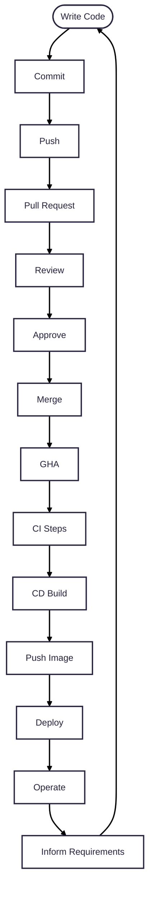

# Deployment Pipeline flow

🐳 Top 10 Issues Developers Run Into When Containerizing Go Code

❌ Large Images

>Cause: Using full OS base images instead of scratch or distroless.

>Fix: Use multi-stage builds to reduce size.

📁 Missing Static Assets

>Cause: Only binary copied; templates/assets not included.

>Fix: Use embed (Go 1.16+) or copy assets explicitly.

🏗 Improper Multi-stage Build

>Cause: Forgetting to move binary from builder to final image.

>Fix: Use Docker’s multi-stage build properly (e.g., builder stage + minimal final stage).

🔐 Permission Issues at Runtime

>Cause: Running as root or user without proper permissions.

>Fix: Use a non-root user and adjust file ownership/permissions.

🌎 Hardcoded Config/Secrets

>Cause: App fails when config is baked in or env vars are missing.

>Fix: Use environment variables or config files mounted via volumes/secrets.

📡 Port Not Exposed

>Cause: App listens on a port not declared in Dockerfile or docker run.

>Fix: Ensure EXPOSE is declared and container listens on the right interface (0.0.0.0).

🛠 CGo Dependencies

>Cause: Go code that uses C bindings won't run on scratch without needed libs.

>Fix: Avoid CGo if possible or use a proper base image with shared libraries.

📦 Outdated or Missing Dependencies

>Cause: Missing go mod tidy or failed cache in builds.

>Fix: Run go mod tidy and cache dependencies correctly in Docker build layers.

🐢 Slow Cold Start

>Cause: Bloated binary or image, or unnecessary startup processes.

>Fix: Trim the binary (-ldflags="-s -w") and use lean images.

💥 Crashes in Different Environments

>Cause: Local and container environments differ (e.g., timezone, locale, OS).

>Fix: Mimic production settings in the Dockerfile and use environment-specific config.
